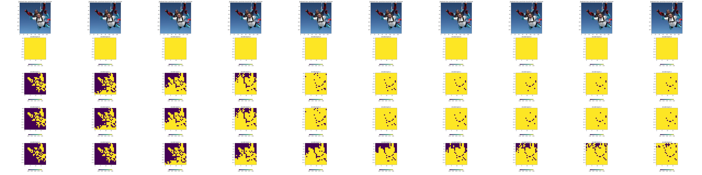

# Peekvit
Implementation of Vision Transformers & variants for experiments.
This repo uses [hydra](https://hydra.cc/) for managing experiment in a modular way.

Before testing, don't forget to `pip install -r requirements.txt`.

### How To: run a quick experiment with default parameters
- Edit the path to your workspace and wandb credentials in `train_config.yaml`. 
- Run `python train/train.py` 

This will download the Imagenette dataset and train a small Vision transformer on it. Notice that each time you run an experiment, a directory in your workspace will be created. Such directory contains the checkpoints for the model (if any) and the logs. 

### How To: run an experiment with custom model
- Define experiment settings (model, dataset, training, losses etc..) in the hydra file `train_config.yaml`. All explanations provided inside the file.
- Run `python train/train.py` 

If your model has a sort of trainable budget, is trained starting from a checkpoint or has custom regularizations, don't forget to set the correspoding parameters in the training configurations (`train_backbone`, `reinit_class_token`, `losses` etc...) 

### How To: write code for a new model/dataset
- Code the new model/dataset and store it somewehere in the repo.
- Add a configuration file for your model/dataset in the configuration direcotories.
- Edit the `train_config.yaml` to use your model/dataset.

### How To: test a model checkpoint
- Locate the experiment directory containaning your checkpoint on your local file system and edit the `load_from` field in the `test_config.yaml`. 
- Edit the parameters for testing in the `test/` hydra configs. There you can decide whether you want to add noise or set budgets to evaluate on.
- Run  `python validate/test.py`. 

Plots for each run will be stored to the run experiment directory where the checkpoint is located, i.e. `load_from`. Plots comparing different runs, if requested via the  `cumulative_plots_dir` will be stored to a new directory that you must provide as `cumulative_plots_dir` field.

### How To: test a model checkpoint and create masking plots
- Locate the experiment directory containaning your checkpoint on your local file system and edit the `load_from` field in the `test_config.yaml`. 
- Edit the parameters for testing in the `test/` hydra configs. There you can decide how many images you want to plot.
- Run  `python validate/create_mask_plots.py`.

You will find the masking plots for the number of images you requested inside the experiment directory. 

### Example Scripts

- Train a vit with default params: `python train/train.py`
- Train a vit with custom params: `python train/train.py model.hidden_dim=318` (you can achieve the same by editing the yaml file)
- Train a residualvit (with masks) starting from a vit checkpoint: `python train/train.py model=residualvit training=finetuning losses=crossentropy_mse load_from=<path to experiment_directory containing vit>`
- Plot the class tokens and their distances for a pretrained vit_b_16 `python validate/create_cls_token_plots.py test.num_images=10 model=vit_b_16 dataset.image_size=224 model.torch_pretrained_weights=ViT_B_16_Weights['IMAGENET1K_V1']`

#### TODOS
- detailed comments for losses
- Examples on comparative plots
- Add images to readme
- Add tiny imagenet
- Add a script for each howto
- default cumulative noise plot when testing noise
- add optimizer choice
